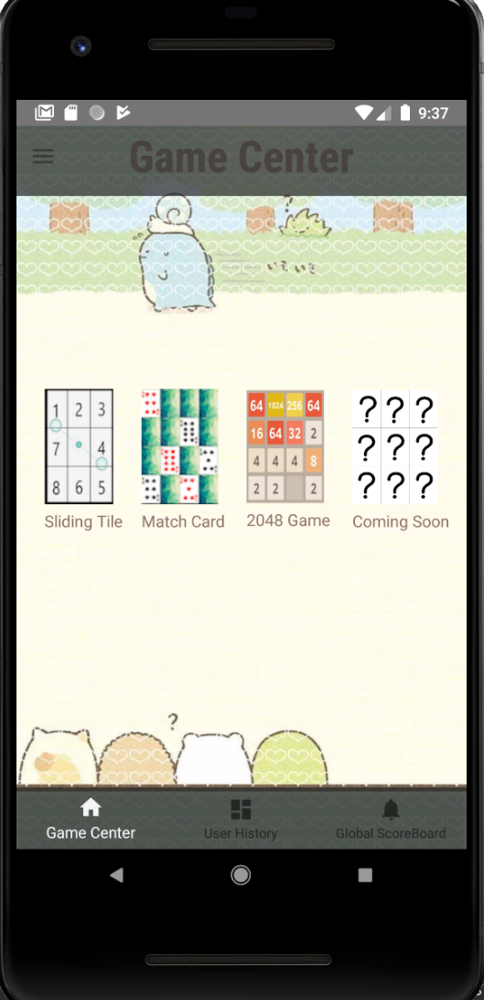
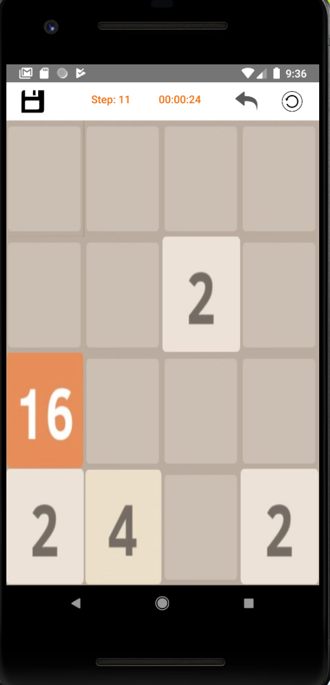
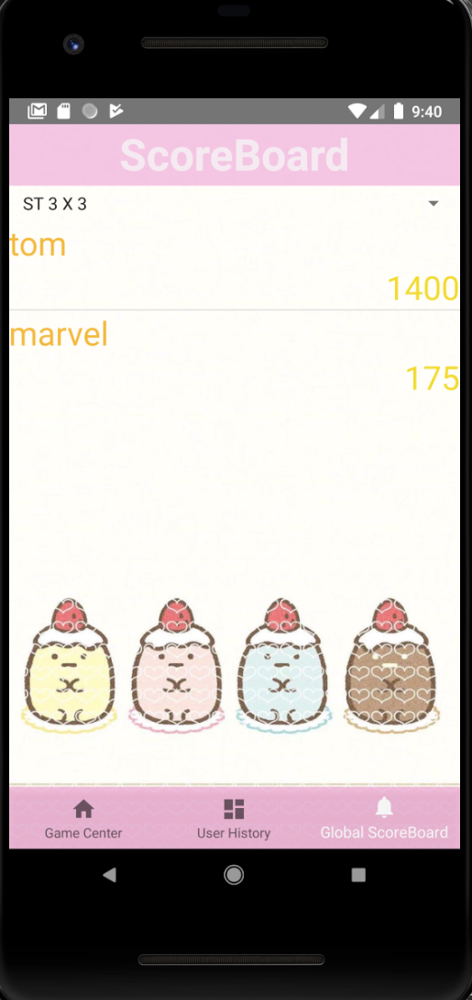

# Intro
This is a previous project worked as a team during school, along with [Jeffson Zhong](https://github.com/imJeffZ), [Marvel](https://github.com/surprise777), [Sailing Zhou](https://github.com/SailingZhou), [Nick Jiang](https://github.com/Nick1225).

Unfortunately during migration I lost all the commitments,
but the Original Project can be found here https://github.com/surprise777/GameCenter2018.

During the development I primarily work on the game logic part of backend, implement desired features, and some frontend ui structures. I also act as a code reviewer after parts of the work I'm responsible for was decided to be removed as a team
due to time constraint.
***

## GameBox

This is a light weight app contains several small games, support user feature, so different users can keep track of their
own progress separately by signing in.

This is the Central User interface.

This is one of the games we created, which is the famous 2048.

This is the scoreboard feature.

***
## Setup
1. Clone the project to your designated repository .
2. Open Android Studio and import the project.
3. Build the project with default gradle.
4. Choose API27, Android SDK 8 and run the emulator.
***
## Problem
* Currently no database was introduced, storing data depends on serialization => Only local data is really available.
* Auto-save sometimes will interrupt the game data in manual save.
* Without solving the asynchronization problem of firestore, We can't rely on firestore.
* The meaning of global leaderboard was vastly decreased without able to retrieve the data coming from other phones.
* No guest login was allowed.
